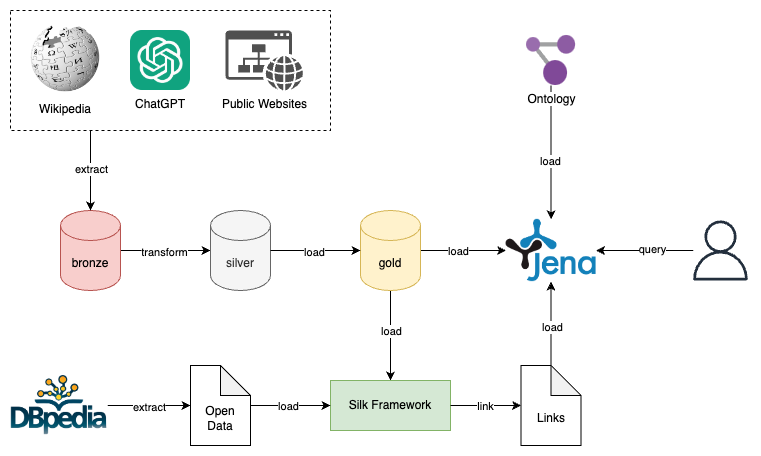

# HUST Semantic Web

## Introduction

### Ontology design


### Architecture



## Setup

### Data processing

### Open data linking (5 stars)

#### Extract open data from DBpedia

1. Go to [https://dbpedia.org/sparql](https://dbpedia.org/sparql)
2. Paste the under query
    ```sparql
    PREFIX dbo: <http://dbpedia.org/ontology/>
    PREFIX rdfs: <http://www.w3.org/2000/01/rdf-schema#>
    PREFIX dbp: <http://dbpedia.org/property/>

    SELECT ?uri ?name ?brandName ?brandFoundDate ?releaseDate ?osName
    WHERE {
        ?uri a dbo:Device ;
        rdfs:label ?name .
        OPTIONAL {
            ?uri dbp:brand ?brand .
            ?brand dbp:name ?brandName .
            ?brand dbo:foundingDate ?brandFoundDate } .
        OPTIONAL { ?uri dbo:releaseDate ?releaseDate } .
        OPTIONAL {
            ?uri dbo:operatingSystem ?os .
            ?os dbp:name ?osName } .
        FILTER (lang(?name) = "en") .
        FILTER (
            regex(str(?uri), "iPhone", "i") || 
            regex(str(?uri), "iPad", "i") || 
            regex(str(?uri), "Galaxy", "i") || 
            regex(str(?uri), "Pixel", "i") ||
            regex(str(?uri), "Oppo", "i") || 
            regex(str(?uri), "Xiaomi", "i") ||
            regex(str(?uri), "Realme", "i") ||
            regex(str(?uri), "OnePlus", "i")
        ) .
    }
    LIMIT 2000
    ```
3. Execute the query with Results Format in **CSV**
4. Save as ```res/dbpedia.csv```

#### Setup Silk framework and linking

1. Run via Docker
   ```shell
   docker run -d --name silk-workbench -p 80:80 silkworkbench/silk-framework
   ```
2. Open the workbench on browser at http://localhost
3. Import project from ```res/silk_project.zip```
4. Upload new data for datasets (optional, because zip file already contains these resources)
    - source: ```res/smartphone.csv``` (converted from ```res/smartphone.rdf```)
    - target: ```res/dbpedia.csv```
5. Run linking execution
6. Download the output data and save as ```res/linked_output_raw.nt```
7. The output should be URI encoded so have to be decoded:
   ```shell
   py src/decode_uri_ntriples.py
   ```
   Enter the input path: ```res/linked_output_raw.nt```

   Enter the output path: ```res/linked_output.nt```

### Setup Jena Fuseki

1. Run via Docker
   ```shell
   docker run -d --name fuseki -p 3030:3030 -e ADMIN_PASSWORD=admin stain/jena-fuseki
   ```
2. Open the UI on browser at http://localhost:3030
3. Create new dataset
4. Import 3 files:
    - ontology: ```res/smartphone.owl.xml```
    - instances data: ```res/smartphone.rdf```
    - links: ```res/linked_output.nt```

5. Go to query section for querying

## SPARQL queries example

### Find smartphones with brand name is 'Apple'

```sparql
PREFIX onto: <http://www.semanticweb.org/hust/master/2024/10/ontologies/smartphone.owl#>
SELECT ?smartphone ?name ?os
WHERE {
    ?smartphone a onto:SmartPhone .
    ?smartphone onto:hasBrand ?brand .
    ?brand onto:name "Apple" .
    ?smartphone onto:name ?name .
    OPTIONAL {
        ?smartphone onto:hasOS ?os
    } .
}
```

### Find Samsung Galaxy smartphones

```sparql
PREFIX onto: <http://www.semanticweb.org/hust/master/2024/10/ontologies/smartphone.owl#>
SELECT ?smartphone ?name
WHERE {
    ?smartphone a onto:SmartPhone .
    ?smartphone onto:name ?name .
    FILTER contains(?name, "Galaxy")
}
```

### Find smartphones have mainCamera video contains '8K'

```sparql
PREFIX onto: <http://www.semanticweb.org/hust/master/2024/10/ontologies/smartphone.owl#>
SELECT ?smartphone ?video
WHERE {
    ?smartphone a onto:SmartPhone .
    ?smartphone onto:hasCamera ?mainCamera .
    ?mainCamera a onto:MainCamera .
    ?mainCamera onto:video ?video .
    FILTER contains(?video, "8K")
}
```

### Find smartphones with ```owl:sameAs``` relationships

```sparql
PREFIX onto: <http://www.semanticweb.org/hust/master/2024/10/ontologies/smartphone.owl#>
PREFIX owl: <http://www.w3.org/2002/07/owl#>
SELECT ?smartphone ?sameAs
WHERE {
   ?smartphone a onto:SmartPhone .
   OPTIONAL { ?smartphone owl:sameAs ?sameAs } .
}
ORDER BY DESC(?sameAs)
```

### Select all pairs of predicate and object of ```iphone_14_pro```

```sparql
SELECT ?predicate ?object
WHERE {
  <http://www.semanticweb.org/hust/master/2024/10/ontologies/smartphone.owl#iphone_14_pro> ?predicate ?object .
}
```